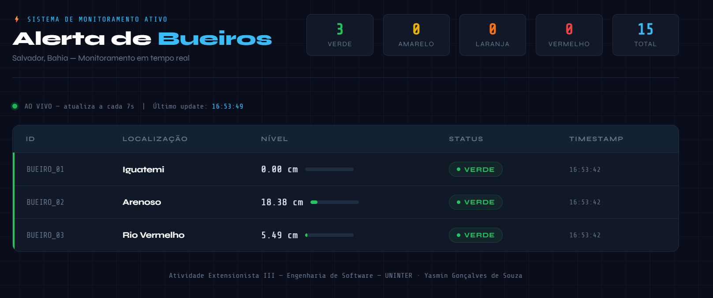

# 🚨 Sistema Inteligente de Alerta Preventivo de Alagamentos

Projeto de Atividade Extensionista — Bacharelado em Engenharia de Software
Centro Universitário Internacional UNINTER

---

## 📌 Sobre o Projeto

Sistema de simulação que reproduz o comportamento de sensores de nível de água em bueiros urbanos. Desenvolvido com foco em comunidades vulneráveis de Salvador/BA — regiões com histórico recorrente de alagamentos durante períodos de chuvas intensas.

Múltiplos sensores simulados monitoram bueiros de forma independente, cada um com sua própria intensidade de chuva e nível de água. Quando o nível atinge limites críticos, o sensor envia alertas automáticos para um servidor central via API REST. Um dashboard web exibe o estado de todos os bueiros em tempo real, com atualização automática a cada 7 segundos.

O projeto foi desenvolvido como **prova de conceito (PoC)**, simulando uma arquitetura distribuída de IoT sem depender de hardware físico.

---

## 🎯 Objetivos de Desenvolvimento Sustentável (ODS)

- **ODS 09** — Indústria, inovação e infraestrutura
- **ODS 11** — Cidades e comunidades sustentáveis
- **ODS 13** — Ação contra a mudança global do clima

---

## 🏗️ Arquitetura

```
[sensor.py]  →  HTTP POST (JSON)  →  [app.py]  →  [index.html]
  Simulador                           Servidor        Dashboard
  3 bueiros                           Flask           Tempo real
  Chuva probabilística                API REST        Auto-refresh
  Escoamento                          Histórico       Visualização
```

Os dois módulos rodam como **processos independentes**, comunicando-se pela rede local via protocolo HTTP — simulando uma arquitetura distribuída real, onde sensores físicos enviariam dados a um servidor central.

---

## 🚦 Níveis de Alerta

| Status | Nível de Água | Significado |
|---|---|---|
| 🟢 ALERTA_VERDE | 0 — 29 cm | Nível seguro |
| 🟡 ALERTA_AMARELO | 30 — 59 cm | Começando a encher |
| 🟠 ALERTA_LARANJA | 60 — 89 cm | Próximo do limite |
| 🔴 ALERTA_VERMELHO | 90+ cm | Nível crítico |

---

## 🌧️ Modelagem da Chuva

A intensidade da chuva não é gerada de forma puramente aleatória. Ela segue um modelo probabilístico em duas etapas, pensado para se aproximar do comportamento real de eventos climáticos — que tendem a se intensificar ou enfraquecer de forma gradual, e não a saltar aleatoriamente entre extremos.

### 1. Cadeia de Markov (estado da chuva)

O estado de chuva de cada bueiro no ciclo atual depende do estado do ciclo anterior, conforme a matriz de transição de probabilidades:

| Estado atual | Sem chuva | Fraca | Moderada | Forte | Muito forte |
|---|---|---|---|---|---|
| **Sem chuva** | 75% | 25% | — | — | — |
| **Fraca** | 35% | 40% | 25% | — | — |
| **Moderada** | — | 35% | 40% | 25% | — |
| **Forte** | — | — | 50% | 30% | 20% |
| **Muito forte** | — | — | — | 80% | 20% |

### 2. Distribuição Gama (intensidade em cm)

Uma vez sorteado o novo estado, a quantidade de água acumulada naquele ciclo (em cm) é gerada por uma **distribuição Gama**, adequada para modelar variáveis contínuas e não negativas como volume de chuva:

| Estado | Shape | Scale |
|---|---|---|
| Fraca | 2 | 1.5 |
| Moderada | 2 | 2.5 |
| Forte | 2 | 4 |
| Muito forte | 2 | 5 |

No estado "sem chuva", simula-se o escoamento natural da água (drenagem), reduzindo levemente o nível acumulado. O nível nunca cai abaixo de zero.

Cada bueiro possui seu próprio estado de chuva, evoluindo de forma independente — simulando variações climáticas regionais dentro da mesma cidade.

---

## 🛠️ Tecnologias

- **Python 3.10+**
- **Flask** — servidor e API REST
- **requests** — comunicação HTTP no simulador
- **numpy** — geração da distribuição Gama
- **random** — sorteio dos estados da Cadeia de Markov
- **datetime** — timestamp dos alertas
- **HTML, CSS e JavaScript** — dashboard de monitoramento com auto-refresh

---

## 📁 Estrutura do Projeto

```
simulador-alerta-bueiro/
│
├── README.md
├── requirements.txt
│
├── servidor/
│   ├── app.py              # API Flask — recebe e armazena alertas
│   └── templates/
│       └── index.html      # Dashboard de monitoramento em tempo real
│
└── simulador/
    └── sensor.py           # Simula sensores nos bueiros
```

---

## ✅ Pré-requisitos

- [Python 3.10 ou superior](https://www.python.org/downloads/) instalado
- `pip` atualizado (`pip install --upgrade pip`)
- Duas janelas de terminal disponíveis (uma para o servidor, outra para o simulador)

---

## ▶️ Como Executar

### 1. Clonar o repositório

```bash
git clone <url-do-repositorio>
cd simulador-alerta-bueiro
```

### 2. Instalar dependências

```bash
pip install -r requirements.txt
```

Conteúdo esperado do `requirements.txt`:

```
Flask
requests
numpy
```

### 3. Iniciar o servidor (Terminal 1)

```bash
cd servidor
python app.py
```

### 4. Iniciar o simulador (Terminal 2)

```bash
cd simulador
python sensor.py
```

### 5. Consultar o dashboard no navegador

```
http://127.0.0.1:5000/
```

---

## 📡 Endpoints da API

| Método | Rota | Descrição |
|---|---|---|
| GET | `/` | Dashboard de monitoramento |
| POST | `/alertas` | Recebe um alerta do sensor |
| GET | `/alertas` | Retorna todos os alertas registrados (JSON) |

**Exemplo de payload enviado pelo sensor:**

```json
{
  "id_bueiro": "BUEIRO_01",
  "nivel_agua_cm": 42.37,
  "status": "ALERTA_AMARELO",
  "timestamp": "2026-09-10T16:54:24.123456",
  "localizacao": "Iguatemi"
}
```

---

## 🖥️ Preview do Dashboard


---

## 🧪 Testes Realizados

- Comunicação HTTP entre múltiplos sensores simulados e o servidor Flask, sem perda de dados;
- Classificação automática correta dos quatro níveis de alerta (verde, amarelo, laranja, vermelho);
- Atualização em tempo real do dashboard a cada ciclo do simulador (7 segundos);
- Comportamento coerente da geração de chuva (transições suaves entre estados, sem saltos abruptos).

---

## 🗺️ Possíveis Melhorias Futuras

- Persistência dos alertas em banco de dados (atualmente em memória);
- Autenticação na API REST;
- Histórico gráfico de nível de água por bueiro ao longo do tempo;
- Integração com dados climáticos reais via API meteorológica;
- Notificações via e-mail/SMS em caso de alerta vermelho.

---

## 📄 Licença

Projeto acadêmico desenvolvido para fins educacionais, sem fins comerciais.

---

## 👩‍💻 Autora

**Yasmin Gonçalves de Souza**
Bacharelado em Engenharia de Software — UNINTER
Atividade Extensionista: Tecnologia Aplicada à Inclusão Digital